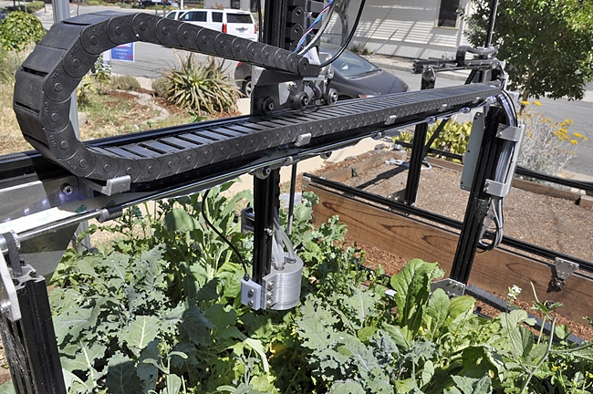
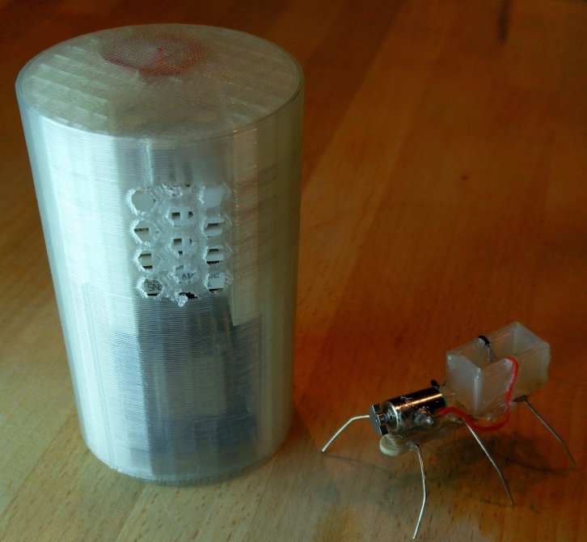

# Things Talking to Things With MQTT

### Rick Carlino

---

# About This Talk

 * Topic
 * Target Audience
 * About You
 * About Me
 * Other Stuff

---

# What We Will Learn

 * Sending information remotely (Arduino -> Internet)
 * Sending commands remotely
 * Getting *realtime* (push) notifications from devices
 * Security and Authentication
 * Dealing with offline situations

---

# Live Demo: The Bell

**What just happened?**

---

# Live Demo: FarmBot

---

# What Can MQTT Do?

 * "Publish" sensor data using "topics"
 * "Subscribe" to user input
 * Handle disconnects
 * Handle security

---

# What Are People Making with MQTT?

---

# Robotics

---

# Telemetry / Sensor Systems

---

# Small Scale Hobby Projects

---

# What is it?

  * Designed in 1999 at IBM. Opensourced in 2010.
  * Goals: Light weight, minimal battery loss, bandwidth.
  * MQTT is not an acronym.
  * It's a message **broker**, Not actually a message queue

---

# Advantages

 * Works on Arudino, browser, desktop, mobile.
 * Optimized to save bandwidth (cellular devices)
 * Standardized
 * Standard is very compact and easy to understand
 * Well written documentation (really!)
 * Transmit anything! (JSON, XML, binary, images- whatever!)

---

# Alternatives

 * REST (not realtime)
 * Raw TCP socket (too much coding)
 * Proprietary "platforms"

---

# Clients

 * [Android MQTT clients](https://play.google.com/store/apps/details?id=at.tripwire.mqtt.client&hl=en)
 * [Web Browser](http://www.hivemq.com/demos/websocket-client/)

---

 # Brokers

Very easy to run your own MQTT server.

 * Mosquitto (`sudo apt-get install mosquitto`)
 * Mosca
 * RabbitMQ (advanced)
 * AWS IoT

---

# Topics, Pub/Sub

 * Organize messages into "topics"
 * Kind of like a chatroom
 * Example: `house/airconditioner/temp_sensors/1`
 * Sensors "publish" to topics.
 * Consumers "subscribe" to get latest readings.

---

# Topic Patterns

 * `+` symbol
 * `/` symbol
 * `$` symbol
 * `#` symbol

EXAMPLES: `/home/sensors/thermostat1`, `/home/sensors/#`, `/$SYS/#`.

---

# EXERCISE: MQTT Chat

 * Server: `67.205.153.250`
 * Port: `8083`
 * Username: `foxbuild`

Before using MQTT on a device, let's use MQTT with our laptops.

[http://www.hivemq.com/demos/websocket-client/](http://www.hivemq.com/demos/websocket-client/)

---

# EXERCISE: "retained" messages

(Wind turbine example)

What if no one is around to receive the message?

[http://www.hivemq.com/demos/websocket-client/](http://www.hivemq.com/demos/websocket-client/)

---

# Quality of Service (QoS)

3 levels:

 * At most once (0) - "unimportant" data, like live streams.
 * At least once (1) - guaranteed delivery, possible duplicates.
 * Exactly once (2) - Most resource intensive for server. **Not possible on all servers!**

---

EXERCISE: "last will" messages

What if you need to react to device failure?

[http://www.hivemq.com/demos/websocket-client/](http://www.hivemq.com/demos/websocket-client/)

---

EXERCISE: MQTT for ESP

Now let's build an MQTT-enabled bell ringer.

---
# Advanced Stuff

 * "persistent" messages (message broker style messages)
 * Last will and testament
 * QoS
 * Distinction from "real" message queues.
 * "retained" messages
---

# Security
 * SSL
 * Shodan and other crawlers.
 * Lax security culture.
 * Malware

---

# Available Hardware

 * ESP
 * Ardunio shields?

---

# Extras

 * MQTT-SN
 * AWS IoT
 * https://shiftr.io/

---
